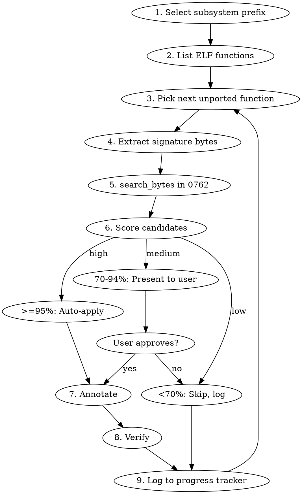

# Ghidra Function Port

## Overview

Rigid skill for matching ELF functions to 0762 functions by byte signature, then fully annotating each match in Ghidra via MCP. One function at a time, subsystem by subsystem.

## When to Use

- User says "port functions", "match functions", "annotate 0762"
- Working on a subsystem and need to identify 0762 functions from ELF
- Any rename_symbol call targeting 0762_Base.hex

## When NOT to Use

- Working only within the ELF (already has symbols)
- Manual one-off renames where the match is already known
- Patching/writing bytes (not annotation work)

## Pipeline (Follow Exactly — Do Not Skip Steps)



### Step 1: Select Subsystem

Ask user for subsystem prefix (e.g., `ACZC`, `MAFI`, `AAPI`, `AAPD`).

### Step 2: List ELF Functions

```
mcp__ghidra__list_functions(program_name="E41_a171712501.elf", pattern="*{PREFIX}*")
```

Create a task for each function found.

### Step 3: Extract Signature Bytes

For the current ELF function:

1. Get hexdump of first 32 bytes:
   ```
   mcp__ghidra__get_hexdump(address="{elf_addr}", len=32, program_name="E41_a171712501.elf")
   ```

2. Build search pattern: Keep prologue bytes (stack frame, register saves) as-is. Replace r15-offset bytes and call-target bytes with `??` wildcards.

   **Byte identification rules for PowerPC VLE:**
   - `e_stwu` (0x18...), `se_mflr` (0x00 0x80), `se_stw` (0xD...) — keep all bytes (stack-local)
   - `e_lbz`/`e_lhz`/`e_stb`/`e_sth` with r15 — keep opcode, wildcard the offset bytes
   - `e_bl` (0x78...) — keep opcode byte, wildcard target bytes
   - `e_lis` + `e_lhz` (cal data pattern) — wildcard the immediate values

3. Use 20-32 bytes of wildcarded pattern. More bytes = fewer false matches.

### Step 4: Search 0762

```
mcp__ghidra__search_bytes(pattern="{wildcarded_hex}", program_name="0762_Base.hex", limit=10)
```

### Step 5: Score Candidates

**If 1 match:** Confidence = 95%+ (auto-apply unless function sizes differ).

**If 2+ matches:** Get disassembly of each candidate and the ELF function. Normalize both:
- Strip absolute addresses from `e_bl` targets
- Replace r15 offsets with `r15+??`
- Replace cal data immediates with `??`
- Compare normalized line-by-line
- Score = matching_lines / total_lines

**If 0 matches:** Try shorter pattern (16 bytes), or try interior bytes (skip prologue, use bytes from offset +16). If still 0, log as unmatched.

**CFG tiebreaker** (candidates within 5% score):
```
mcp__ghidra__get_basic_blocks(function="{addr}", program_name="0762_Base.hex")
```
Compare block count and sorted block sizes. Prefer exact match.

### Step 6: Annotate (ALL steps required — do not leave partial)

Execute in this exact order:

1. **Rename function:**
   ```
   mcp__ghidra__rename_symbol(address="{0762_addr}", new_name="{elf_name}", program_name="0762_Base.hex")
   ```

2. **Set prototype:**
   ```
   mcp__ghidra__get_function_info(function_name="{elf_name}", program_name="E41_a171712501.elf")
   ```
   Then:
   ```
   mcp__ghidra__set_function_prototype(function_address="{0762_addr}", prototype="{signature}", program_name="0762_Base.hex")
   ```

3. **Map and rename globals:**
   Get disassembly from both programs. For each r15+offset access:
   - Match by instruction position (Nth r15 access in ELF = Nth in 0762)
   - Look up ELF symbol name for the ELF offset
   - Compute 0762 absolute address: r15_base + 0762_offset
   - Rename:
     ```
     mcp__ghidra__rename_symbol(address="{0762_global_addr}", new_name="{elf_symbol}", program_name="0762_Base.hex")
     ```
   For cal data (e_lis/e_lhz pattern):
   - Reconstruct full address from both programs
   - Same positional mapping, rename in 0762

4. **Create structs** (if ELF function references custom types):
   ```
   mcp__ghidra__get_data_type(name="{struct_name}", program_name="E41_a171712501.elf")
   ```
   Then:
   ```
   mcp__ghidra__struct(action="create", definition="{C_definition}", program_name="0762_Base.hex")
   ```

5. **Set local variable types** (where ELF has them):
   ```
   mcp__ghidra__set_local_variable_type(function_name="{0762_name}", variable_name="{var}", data_type="{type}", program_name="0762_Base.hex")
   ```

6. **Add plate comment:**
   ```
   mcp__ghidra__set_comment(address="{0762_addr}", comment="Ported from ELF: {elf_name} @ {elf_addr}", comment_type="plate", program_name="0762_Base.hex")
   ```

### Step 7: Verify

Re-decompile the 0762 function:
```
mcp__ghidra__get_code(function="{0762_name}", format="decompiler", program_name="0762_Base.hex")
```

Confirm: function name appears, global variables have Ve*/Ke*/Vb* names, return type is correct.

### Step 8: Log to Progress Tracker

Update `docs/ghidra-port-progress.json` with the function result.

## Red Flags — STOP

| Thought | Action |
|---------|--------|
| "I'll just rename it without the full pipeline" | STOP. Use the pipeline. |
| "The match is obvious, skip scoring" | STOP. Score it. Evidence before assertions. |
| "I'll do globals later" | STOP. Complete all annotation steps now. |
| "Verify is unnecessary" | STOP. Always verify. Re-decompile. |
| "I'll batch the renames" | STOP. One function at a time. |

## Quick Reference: MCP Tools Used

| Tool | Purpose |
|------|---------|
| `list_functions` | Find functions by subsystem pattern |
| `get_hexdump` | Extract signature bytes |
| `search_bytes` | Find matching function in 0762 |
| `get_code(disassembly)` | Normalized comparison |
| `get_basic_blocks` | CFG tiebreaker |
| `rename_symbol` | Rename function and globals |
| `set_function_prototype` | Apply function signature |
| `get_function_info` | Read ELF function details |
| `get_data_type` | Read ELF struct definitions |
| `struct(create)` | Create structs in 0762 |
| `set_local_variable_type` | Type local variables |
| `set_comment` | Add porting reference comment |
| `get_code(decompiler)` | Verify annotations |

## Common Mistakes

- **Wrong program_name:** Always specify `program_name` explicitly. ELF for reading, 0762 for writing.
- **Partial annotation:** Renaming without prototype/globals makes function look done but isn't. Complete all steps.
- **Trusting address match:** Most functions are NOT at the same address. Always use signature matching.
- **Forgetting r15 base:** r15 offsets are signed. The absolute address = r15_base + offset. Get r15_base from program context.
